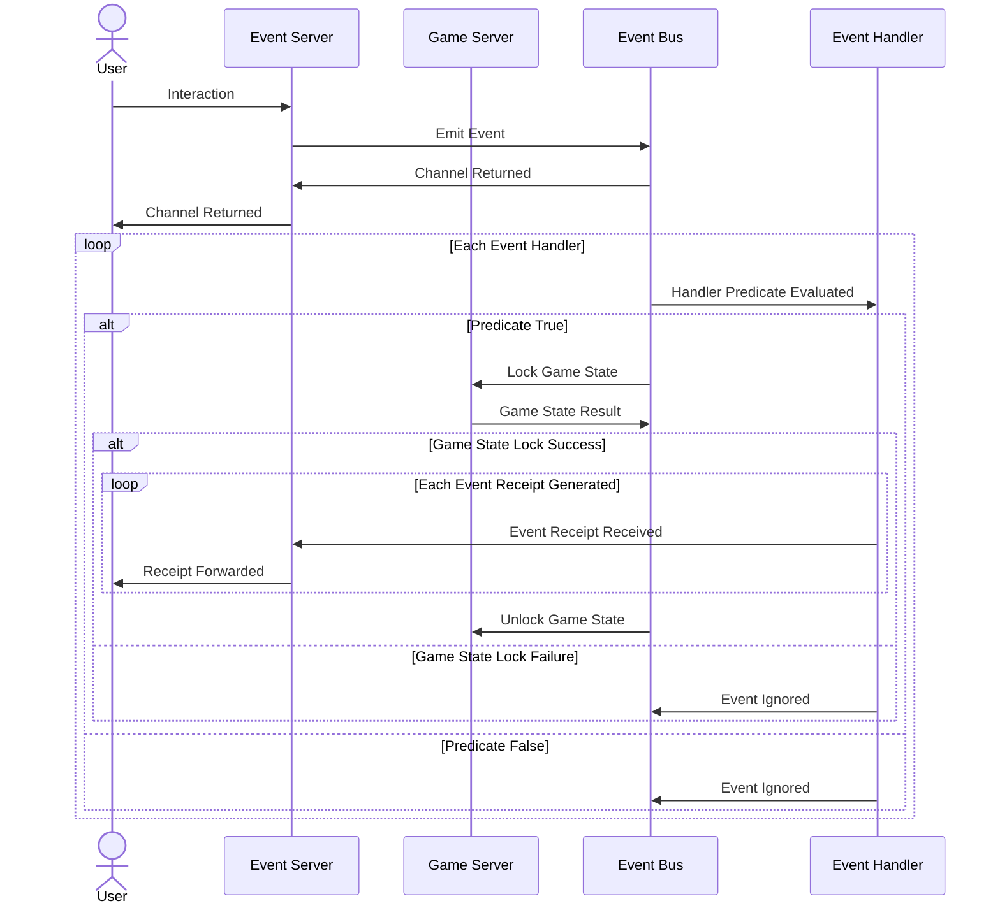

# Game Engine

The game engine is where the largest amount of logic is implemented.
The engine is an event-driven real time system that manages the state of the game.
Today the event bus is in-memory with distributed locks managed at the higher level.
This means that event handlers can **_safely_** assume that they are the only ones processing an event at a time.

## Architecture

The game engine is designed for a realtime MUD environment. 
That means that `n` number of players could be concurrently interacting with the game world.
In that scenario we want to accept as many of their requests as possible, but we don't necessarily want to process all of them at the same time.
Game state needs to be mutated sequentially in the order received from the clients.
Thus while all the events are being processed in separate routines, the game state is locked when a handler selects to process an event. 
The engine submits a lock and waits for a reply from the game server -- ideally queuing these lock requests. 

### Things to Test/Figure out

- What are the implications of long wait times?
- Do all events require a lock (talking to the DM in a non-material manner may be desired?)
- Is there a deadline for an event to be processed? (if it takes 5 seconds for a game event to be processed and 70 events occurred before that one, mutating game state significantly should be still try to handle the event?)

### Key Architectural Points

1. The event bus is expected to record the event within the storage layer while event handlers are expected to store their own receipts
