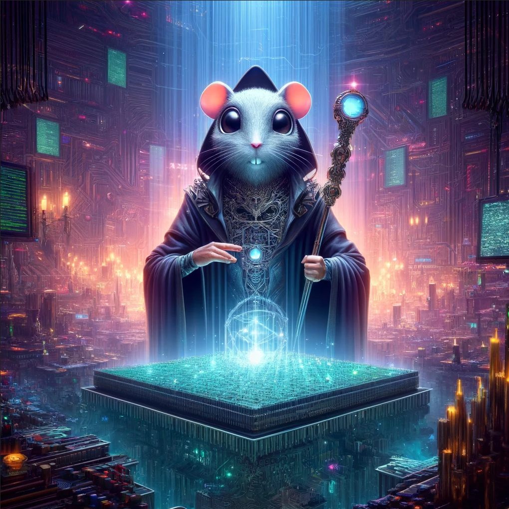

<div align="center">
    <i>
        <strong>
            <h1>Overseer</h1>
        </strong>
        <h6>A generative AI Multi-User Dungeon</h6>
    </i>
    </img>
</div>

Overseer is an AI-led, _multi-modal_, MUD following the DnD model of play. 
The idea of Overseer is whether your posse is on Discord, Slack, or spread across many platforms, you can all play together in the same world designed and led by a dungeon master controlled by a Large Language Model.

## Development

To run locally this project by default depends on[Ollama](https://github.com/ollama/ollama) or rather an Ollama-compliant API. 
In order for overseer to communicate to ollama we need a configuration file `overseer.yaml` somewhere on the system we expect, the root of this directory is supported and git ignored by default.
A example configuration could look like:
```yaml
server:
  enableSystemToken: true # enable the system user - not advised for adverserial environments
  systemToken: catdog # set the system user token to a known value but not easily guessable
templating: 
  templateBasePath: "./templates"
ollama:
  insecure: true # for local development this is fine but absolutely not advised for adverserial environments
```
The easiest way to get up and running is by running `ollama serve` after installing ollama and then `go run main.go server -r`
The `-r` enables gRPC reflection which ought to enable you to run  [grpcui](https://github.com/fullstorydev/grpcui) via a command such as `grpcui -port 8080 -open-browser=false -plaintext localhost:4242`.
Now navigate to `http://localhost:8080` to use the gRPC UI to interact with the API.
